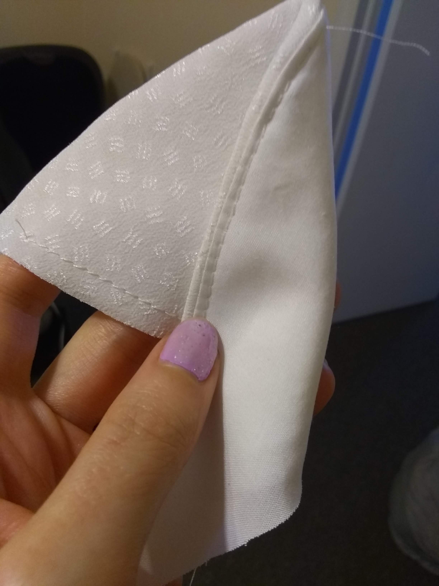
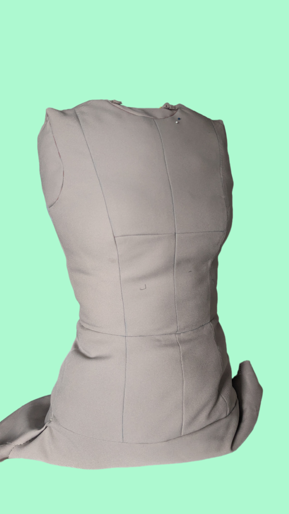

The COVID-19 pandemic led to a period of uncertainty, disruption and reflection. It was a stressful time for everyone and more so for frontline workers. Many who were temporarily out of a job or for their first time working from home found themselves with more time on their hands. Trying out new things was a way to move forward and gain a sense of agency during COVID. One of those things for me was learning how to sew. (I also became very interested in birds 😺). <!---more-->

<!---[example bird pattern fabric](/images/sewing_hobby_birds.jpg "*In pursuit of the perfect bird pattern fabric*")
|-|-| -->

I had never really been interested in fashion. I hated shopping for new clothes. Trying on dresses for birthday parties, graduations and other events only led to frustration as I never liked how I looked or felt. If I found something I **liked**, the article of clothing most of the time didn’t have a good fit; maybe the sleeves were too long, shoulders too wide or bust was too tight or loose. And when I found something that **fit**, the item was usually “in” or “trendy”. Pride in my uniqueness, individuality and self expression took a toll.  

Altering and creating my own clothes was never something I thought I would have the ability and time to do, but made a lot of sense for it to become an outlet for me during Covid. A special occasion had been recently scheduled within a year. I thought "why don’t I learn to sew, make a dress from scratch, I’ll have one year to make it, right?". Long story short, I had so much fun learning about how to make my own [moulage](https://www.craftsy.com/post/moulage-sewing-techniques/) from Suzy Furrer's course [Patternmaking Basics: The Bodice Sloper](https://www.craftsy.com/class/patternmaking-basics-the-bodice-sloper/) on Craftsy. I got sidetracked on making my own dress form using what I learned from the moulage course. I didn’t have time to finish the dress.

| | |
|-|-|

Strangely enough, I wasn’t stressed about not finishing the dress in time for the event that at the time was just one month away. I had visited my local thrift store, [Life Boutique Thrift](https://www.instagram.com/lifevintageandthrift/), and found the perfect back-up. The dress was the just the right color and style for the special occasion I had coming up. However, it was too big in certain areas and could use some alterations to make it more modern and fun. Instead of buying a new dress, I decided to take on the challenge of fitting it myself.

I borrowed my mom’s old Singer 30215 sewing machine and with the supplies I’ve slowly been purchasing, I tailored the dress to fit me perfectly and I felt proud of myself. Learning how to sew at first was a crazy dream, but so grateful I took the effort to pursue it.

The event came and went, and I likely won't wear the dress again, but the experience of learning a new skill and being able to create something with my own hands was priceless. I look forward to going on more sewing adventures and expanding my skills even further.

| | |
|-|-|
