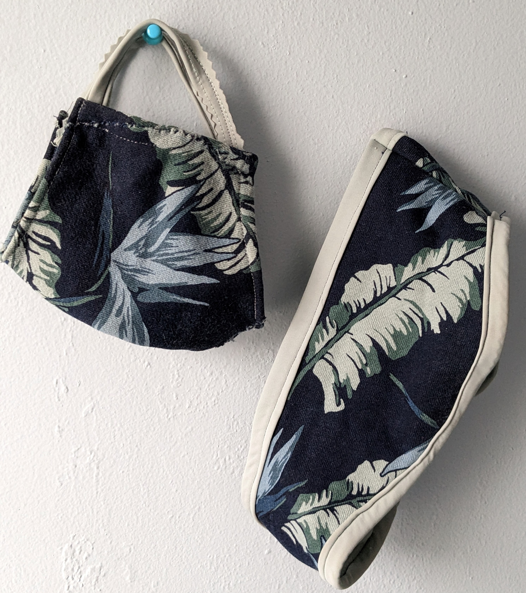

With the winter season coming to an end, you may find yourself staring at a pile of old sweaters, cardigans, and other winter clothing that you no longer wear or that have seen better days. But before you toss them out or donate them, why not upcycle them into something new and useful! <!--more--> Upcycling is a great way to reduce waste and give new life to old items. In this post, we will explore the sweater challenge: upcycling old winter clothing into something new and fabulous.

This past winter I took on the challenge. I had 7 old sweaters, 3 cardigans, 2 old scarves, and a too-tight winter jacket and fleece-lined leggings. While I haven’t made a huge dent as I would have liked, the learning experience and the creative outlet have been extremely satisfying. Here are below and after photos of upcycled winter items.

| Before | After |
|:------:|:-----:|
|   |  |
|   |     |
|   |  |
|  |  |

# Step 1: Gather your materials

To begin your upcycling project, go through your closet and pull out old, worn, or never used winter items. Gather your scissors, seam ripper, fabric marking pen, sewing machine or needle and thread, and any additional materials you may want to use. Additional materials you may want to have are buttons, zippers, bias tape, or fabric scraps.

List:

+ Your Closet 
+ Old winter clothing
+ Cutting, marking, and other sewing tools
+ Sewing machine or needle & thread

# Step 2: Choose your project

There are many ways to upcycle old sweaters, so choose a project that speaks to you and your skill level. Here are eight ideas to get you started:

- Sweater pillow covers: Cut the sweater into squares or rectangles and sew them together to create cozy pillow covers.
- Mittens or gloves: Use the sleeves of the sweater to make mittens or gloves. You can add a lining for extra warmth.
- Cozy hats: Cut the sweater into the shape of a beanie or hat and add a pom-pom or other embellishments.
  - Easily find a free pattern online
  - Here is the pattern I drafted 
- Scarves or cowls: Cut the sweater into long strips, making sure to use the part with the most interesting texture or design. Sew the ends together to create a loop, and you have a warm and unique scarf to wear.
  - I followed this video Hooded Jumper/Scarf - 30 Second Tutorial #ReuseMonth
       
- Leg warmers: Cut the sleeves off the sweater and use them as leg warmers. You can add elastic at the top to keep them in place.
- Headbands/Ear Warmers: Cut a strip from the sweater, about two inches wide. Sew the ends together to create a loop. You can also add a strip of elastic on the inside of the headband to help it stay in place.
  - Watch X - pulled the pattern of an ear warmer I already had, and followed AlejandraMezaDIY to make a twisted headband on Instagram 
  

- Sweater blanket: Combine a bunch of old sweaters to make a cozy blanket. Cut the sweaters into squares or rectangles, making sure they are all roughly the same size. Think about the pattern and repetition when sewing the pieces together. Leave a little extra fabric on each edge for a finished look. 
- Tote bags: Old sweaters/jackets can also be transformed into handy tote bags. Cut the sweater to the desired size and shape, and sew the sides and bottom together. Add handles made from fabric or rope, and you have a stylish and eco-friendly tote bag.
  - Watch x Making my DREAM Pinterest wardrobe! | DIY Puffer Hobo Bag thrift flip  

# Step 3: Get creative

Don't be afraid to experiment and get creative with your upcycling project. You can mix and match different sweater patterns or colors to create a unique look. You can also add additional embellishments like embroidery or appliques.

# Step 4: Enjoy your new creations

Once you have completed your upcycling project, enjoy your new creations! Not only have you reduced waste by giving new life to old items, but you have also created something unique and personalized.
Happy photos

Upcycling old winter clothing into something new and fabulous is a fun and eco-friendly way to get creative and reduce waste. With a little imagination and some basic materials, you can transform old sweaters into something new and useful. So grab those scissors and start upcycling!
