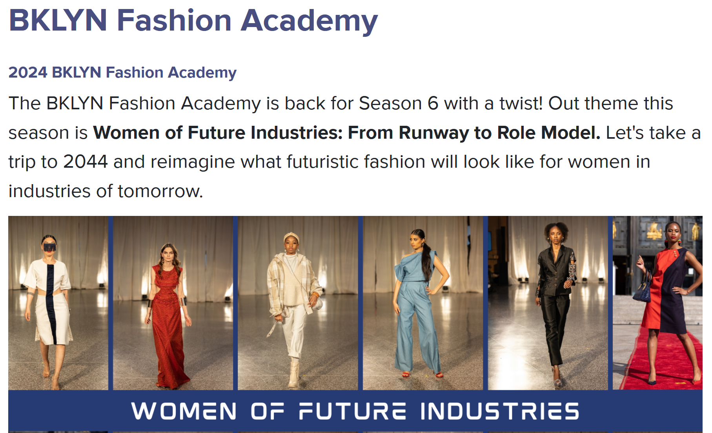

Last year, I joined the BKLYN Fashion Academy's sixth season—an incredible program that more aspiring designers should know about. The Academy (BFA) takes designers on a four-month journey to a runway finale. The 2024 cohort created mini-collections under the *Women in Future Industries* theme. I interviewed fellow designers Gia, Regina, and Ronen, and together, we tell it all—from the creative challenges that tested both our skills and resolve, to our growth as design professionals. <!--more--> Our accounts reveal the program's essence: a journey that validates fashion aspirations, expands creative boundaries, and builds professional resilience. Our candid insights can help anyone considering this opportunity and, who knows, it could be the catalyst for your own design career.

# The Journey Begins with Doubt 

A glance at our profiles on the [BFA webpage](https://www.bklynlibrary.org/bklyn-fashion-academy) showcases our rich diversity—we vary in age, backgrounds, careers, styles, and even sewing experience. Some designers arrived with formal fashion training and years of expertise, while others, like me, discovered sewing as a creative refuge during the COVID lockdown. Regardless of our differences, it is clear that we all hold a strong interest in fashion. Surprisingly, we even share similar self-doubts. From Gia balancing family obligations and critical voices, Regina's six-year trajectory from fashion novice to designer, to Ronen's artistic curiosity leading him into uncharted territory, and my own evolution from refashion amateur to runway designer—we all wrestled with the same insecurities: *Can I really do this? Am I talented enough? Do I belong here?* These doubts, however, became the foundation for our growth throughout the program's intense, transformative journey.

## Balancing Family, Critics, and Fashion Aspirations — Gia

"I had people tell me I wasn't talented enough to be a designer," Gia confides. Despite holding a degree in fashion, she delayed applying to the BFA for a year, carefully planning how to balance her commitments to two children, four dogs, and a husband. "If I can't invest 100% into something, I'd rather not do it. I didn't want regrets… I wanted to give it my best shot." Her persistence paid off when her mother—once her biggest critic—praised her runway show. That moment validated her efforts and proved that self-belief can overcome setbacks.

## A Transition into Fashion, Six Years in the Making — Regina

Regina heard about the BFA six years ago in an entrepreneurship class. Although she lacked the basics then—"I didn't know how to sew, sketch, or design"—her desire for fashion only grew stronger. Even after enrolling in classes and learning the basics, self-doubt lingered. "I wasn't sure my designs were strong enough," she shared. At friends and family's insistence—"Just apply—you have nothing to lose\!" she submitted last-minute. This leap turned her long-held dream into concrete steps toward launching her own brand.

## An Artist’s Curiosity Leads to New Possibilities — Ronen

Ronen, a visual artist, discovered the BFA by chance through an email in a rarely-checked inbox. Curious, he attended an info session and applied on a whim, attracted to working with textiles three-dimensionally.  "I had no idea what I was getting into," he laughs. "I thought it would be skill-building workshops—just lessons on fashion and garment-making." Though comfortable with sewing machines for flat projects, he assumed his lack of formal training would disqualify him. However, to his surprise, gaining acceptance to the program expanded his artistic boundaries and revealed new possibilities in fashion design.

## A Refashion Amateur Finding Her Way — Me

My journey began during the COVID lockdown in 2020, when I explored a new hobby in refashioning garments. Frustrated with my slow self-taught progress, I felt stuck—until my sister shared an Instagram post about the BFA. With just two reworked pieces to my name, I applied on the final day, doubting my readiness like Regina. The chance to combine my data skills with refashioning drew me in—I saw potential for content creation and innovative business ventures. By the program’s end, I went from beginner to confident designer within a short span. Though the journey was challenging, I’m proud of my achievements and the program's role in my growth—now a foundation for bigger dreams.

Having shared from where we started, next is the fun part, our designer personas and original visions!

# Envisioning Women in Future Industries

Our collections imagined women's evolving roles across many sectors, with designs that reflected both our personal experiences and forward-looking perspectives. From Gia's vision of self-sustaining technology empowering the next generation, Regina's conservative elegance for executive women in finance, to Ronen transforming legal wear into vehicles for social justice and my own focus on women's strength and bravery in emergency services—we each translated personal values into distinctive visions of women's futures.


This is an optional paragraph that appears above the gallery.



This is an optional paragraph that appears above the gallery.


 

## A Self-Sustaining Future

Choosing technology as her industry, Gia envisioned a self-sustaining future. “When I think of technology, I think of androids or machines. I wanted to create something self-sustaining," she explains, drawing from sci-fi influences from the video game Deus Ex. Her vision is "a hope for the future” where her children and others grow up capable, independent, and resilient. “I want my designs to empower women, to make them feel strong and capable.” Gia aims to design for everyone—from statement pieces to everyday wear, even pets. Her collection reflects her commitment to client satisfaction: “More importantly, I want to design for women in a way that brings them joy. I design for myself, but if my client isn’t happy, then I’ve failed.”

## Conservative Elegance for the Executive Woman

Driven by an entrepreneurial spirit, Regina’s long-held dream of dressing executive women gave her collection focus. Choosing finance as her industry, she explains: "I've always wanted to design for powerful, professional women. Our assignment was to create a vision for women in 2042, but I concentrated on future business attire. It was a dream to be selected and create a mini-collection on this theme." Her brand, 'Reserved Wear,' reflects her journey and style, empowering women in corporate roles with sophistication and personality.

## Fashion as Social Commentary

While curiosity drew Ronen to the BFA, his collection became a platform for powerful ideas. Under the 'Law' theme, his vision drew from social movements and intersectionality, reflecting his personal convictions. "Novels about the Black experience in Brazil and decolonial theory, including texts about Palestine, influenced my work," said Ronen. "As an anti-Zionist, I see my designs participating in broader conversations on decolonization and justice." He designs for those who wish to express these ideas through fashion. Ronen sees advocates in the legal field wearing fashion as a performative statement to advocate progressive values, dismantle colonial legacies, and promote social justice. 

Not only that, Ronen sees fashion as a dialogue platform on and off runways. "Runways already have an audience and excitement—why not use that space to engage meaningfully? I view it as a form of public art, whether on the runway or on the street, where people wearing my designs make a statement beyond the conventional spaces for art and social commentary, like academia or other cultural spaces." Fashion design has deepened his commitment to social justice, offering a new expressive medium blending aesthetics with activism.

## Strength & Bravery for the Everywoman

From a data project on occupational segregation, I discovered the emergency services sector remains predominantly male with minimal progress toward gender parity. This insight inspired my collection championing women in this essential field. Focusing on firefighter turnout jackets, I incorporated visibility and protective elements using deconstructed thrifted garments and textile waste. My vision for 2044 celebrates women's strength and bravery, aiming for a future where they are better represented and honored in these vital roles.

While creating my collection, I not only developed a vision for more women in the field, but also fortified my broader approach to design. I seek to redefine fashion beyond luxury brands and celebrity culture, prioritizing fit, durability, and individuality. My vision revolves around slow, personal, and repurposed designs that tell stories of conscious consumption and practicality. The BFA's sample development and sustainability classes have inspired me to explore these aspects further.

With our visions in place, we now set to turn our designs into runway-ready garments—the hard part. 

## Embracing the Struggle

This program is not for the faint of heart. It pushed us to our limits, testing our skills, time management, and emotional strength. While taking our designs from concept to creation was a demanding journey, these challenges led us to become more resilient and skillful designers. From managing the weight of creative pressure, learning to give ourselves grace, and to facing the double-edged nature of the runway, our journey revealed the true power of persistence—proving that success comes not from avoiding struggles but from embracing them head-on.

## The Weight of Creative Pressure

When discussing creative roadblocks—those moments when patterns don't line up or materials run short—Gia offered a simple strategy: "I allow them to happen and give myself grace. We're not machines. If I hit a block, I take it as a sign to rest. I step away, play video games, or watch tutorials. Learning something new helps me reset."

Gia found stepping back essential to creativity. I struggled with letting go and in hindsight regret not adopting her approach. Seeking perfection left me depleted by runway day. As Gia noted, we were "running on fumes" as we poured ourselves into our designs. "It's an artistic endeavor... you're giving yourself into your designs.” This emotional investment fueled creativity but amplified pressure. The physical and mental toll of building each piece affected everyone, with Regina facing similar challenges, recalling the weight of that commitment:

“This was my first mini collection—designed, sketched, and constructed entirely by me. We couldn’t seek outside help... there were days when I wanted to quit. Balancing work, family, and this program was overwhelming.”

## Learning to Give Ourselves Grace

Giving ourselves grace became a common mantra. For Regina, creating her first mini collection while balancing work and family meant adjusting expectations without sacrificing her vision. Her support system became her anchor: "They kept me going. I kept thinking, 'I can't do this,' but their encouragement made me learn to give myself grace. I was hard on myself, but tried to ease up as the deadline approached." Though we worked independently, a community of mentors, fellow designers, and loved ones supported us throughout.

Like Regina, this was my first mini collection as well, and the balancing act—along with the sacrifices—were real. My struggle with perfectionism taught me about limits—I pushed toward an ideal only to find, as the runway day approached, I'd taken on more than I could manage, a tough lesson in setting realistic expectations.

## The Runway: Pressure and Promise

The runway show—our end goal—was both exciting and daunting. We all questioned our ability to pull it off. Yet it drove us forward. Ronen described the mixed emotions: "There's a feeling that something exciting is waiting at the end, like a prize. For many, especially those hoping for a breakthrough in fashion—it feels like an opportunity you can't miss." He added: "The timeline is tight, the pressure intense, and the workload overwhelming. That's why it becomes so emotional—there's fear of missing out, but also a deep determination not to fail." 

Even at what Ronen called "near breaking points," we pushed through to create pieces we were PROUD of.   
After hours of meticulously plaid pattern matching, Regina captured the powerful yet modern aesthetic she envisioned for executive women with her tailored plaid jacket paired with neutral box shorts design. Gia managed to balance family responsibilities with the painstaking process of collecting discarded CDs, experimenting with cutting techniques to prevent cracking, and individually hand-sewing hundreds of iridescent pieces to create her "Solaris" look that captured light from every angle. Ronen, who had never sewn garments before, learned to manipulate fabric into intricate horizontal pleats throughout his purple ensemble, creating a dramatic silhouette that boldly challenged Western fashion conventions while referencing Indigenous and African aesthetics as a decolonial gesture and social stance. 

Despite not completing my fourth look, I made it to the show with three emergency services-inspired designs that transformed protective elements into contemporary streetwear. The high-visibility accents and reflective tape on my navy jacket merged firefighter turnout gear's strength with an urban aesthetic that empowers women. Overcoming my nerves to walk the runway alongside models wearing my designs was exhilarating—a reminder of what we can achieve when we overcome doubts and embrace hard work.

## The Power of Persistence

In *The Practice: Shipping Creative Work*, Seth Godin, entrepreneur and best selling author known for his insights on leadership and creativity, explains that learning and growth requires discomfort: 

“Desirable difficulty is the hard work of doing hard work…Learning almost always involves incompetence. Shortly before we get to the next level, we realize that we’re not yet at that level and we feel insufficient. The difficulty is real, and it’s desirable if our goal is to move forward.”

The hard work, doubts, and pressure weren’t just obstacles—they were what pushed us forward. Simply showing up, despite uncertainty, allowed us to grow in ways we never expected. As Ronen shared: “There’s an element of risk. You don’t know if it’s going to work, and then it does and it’s like winning the lottery.”

Our self-doubts were real—Regina and I wished for more practice and Gia worked to prove her critics wrong. Ronen recalled during the selection process a panelist who questioned if he could even make a T-shirt. Yet despite it all, we delivered.

Seth Godin’s advice on creative work resonates here as well: “The magic is that there is no magic. Start where you are, don’t stop.” Godin also highlights the distinction between talent and skill:

“Many people have talent, but only a few care enough to show up fully, to earn their skill. Skill is rarer than talent. Skill is earned. Skill is available to anyone who cares enough.”

As we learned, there’s no magic—just the work. The willingness to start from where we are and to keep going. Success is about embracing the struggle, not avoiding it. The BFA journey proved this—and as we reflect on our individual paths, we can now see how our personal transformations extend far beyond our design portfolios.

# Program Reflections

## Personal Transformation

The BFA program marked a clear before-and-after change in us all. It transformed us as designers by nurturing our creative identity, building professional confidence, and ultimately reshaping our career aspirations through the powerful experience of seeing our work move from concept to runway. It was more than learning advanced sewing or creating runway looks; it was about discovering our potential and finding validation in our work.

Gia reflects on how the experience reshaped her self-perception:

“It gave me confidence—not just in the process of designing but in seeing my work validated at the end. Even though the audience was mostly there for support, having people look at what I created made me feel seen. I don’t know if they actually thought my designs were good, but the fact that they engaged with my work meant a lot…”

She adds, 

"Not everyone can be like Rick Owens, designing purely for themselves. He once said he doesn't care about an audience, but most of us need validation to some degree."

I agree. Seeing our collections come to life on the runway and having an audience engage with them is powerful. The runway is where we share our work and make it professional.

Regina, similarly, shares how the experience redefined her ambitions:

“Before the show, I wasn’t sure I could do this, even after taking sewing classes. I didn’t know where I fit in the fashion industry. Now, after completing the program, I know I want to push forward and see how far I can go. Showing my work on the runway opened the door for me, and the positive reception has motivated me to start my own line — even if it's just a small collection.”

Presenting a collection on the runway for the first time — and realizing it could lead to launching a brand — is the dream for many BFA participants. The program builds confidence that drives us to keep pursuing our goals—a priceless outcome.

Ronen expressed his awe at what he accomplished, having never sewn a garment before the program:

“Wow, I can actually do this. It’s almost magical, especially for someone like me, with no prior experience. It was uplifting and empowering. I didn’t know what to expect, but all the excitement and hype made it positive. That said, the pressure of having to create something presentable definitely pushes you to grow.”

For designers like Ronen and me, learning new techniques while applying them for the first time was daunting. Drafting, cutting, and sewing felt overwhelming. Yet seeing our designs on the runway — realized and complete — was magical and worth it.

Before the program, I wasn't *on the hook*, as Seth Godin puts it. I sewed for myself, and my progress was slow. After completing the program, I no longer fear the speed of the sewing pedal and delivered three looks on the runway. I learned about the industry and feel capable of moving forward. That's the program's magic—it demands hard, self-driven work, which makes the achievement all the more meaningful.

## Program Realities & Opportunities for Improvement

The Brooklyn Fashion Academy offered a transformative blend of creative expression and rigorous hands-on work. However, the initial flyer and info sessions didn't convey its demanding nature; the long hours, problem-solving, and pressure became evident only after immersion. While delivering an impressive runway show that exceeded all of our expectations, my fellow participants and I identified four areas for improvement: 1\) planning clear timelines, 2\) more transparent workload expectations, 3\) additional teaching support, and 4\) enhanced mentorship resources. 

### Improving Structure and Planning

I told fellow designers 'the program gave us a false sense of security until we were suddenly out of time'—a concern many shared. Gia noted, 'We needed a clear timeline and more accountability. Advice to multiply time estimates helped, but structured deadlines would have made runway preparation less stressful.' While we valued the program's hands-on, self-driven approach, a more structured calendar with deadlines well before the runway countdown could have reduced pressure. With the program running from May to September, I'd suggest completing one garment—or one major construction step—monthly. Assigning models and sizes in advance would also eliminate a significant source of stress for participants.

### Setting Clear Expectations

Ronen brought up how the program needed to be more transparent about the workload and what to expect in terms of instruction versus self-driven learning. Clearer communication upfront, he felt, would have helped: "They didn't really warn us about just how intense it would be. Before accepting people into the program, there should be a clearer explanation of what's expected and exactly what will and won't be taught. They should be upfront—this isn't a comprehensive sewing course."

### The Self-Learning Reality

The program also focused more on problem-solving than formal instruction—a surprise to many of us. Both Ronen and I had anticipated more guidance, especially since the program description mentioned advanced sewing techniques. Instead, “we had to figure out a lot on our own,” Ronen recalled. “Our mentor would give us a push in the right direction, but the rest was up to us.”

To fill knowledge gaps, we relied on YouTube tutorials and library books with varying success. Our cohort created an informal support network, actively sharing resources and advice through our WhatsApp group. Ronen felt more structured guidance would benefit beginners: "I'd recommend more introductory sessions on basics—my biggest challenge was not knowing fundamentals. Learning through random YouTube videos and books was tough. Since the program only requires basic sewing skills, not a fashion degree, it should provide more foundational instruction."

### More Mentorship Support

Regina proposed that personalized, one-on-one mentorship could make a significant difference. Throughout the program, we relied solely on Ben Mach—former Project Runway all star—who provided valuable support during sessions and via WhatsApp. However, having just one mentor for up to 20 participants felt insufficient for many of us. I agree with Regina. Personalized mentorship would have accelerated our growth, ideally creating lasting relationships that could guide our careers beyond the program—the icing on the cake of an already valuable experience.

### The Runway is the End Game

The runway show was undeniably the program's centerpiece, creating both excitement and pressure. Ronen reflected on its production value: "I'm not sure how intentional it is on the part of the administrators and organizers, but there's a certain sense of glamour surrounding the show—CBS covering the story, the audience turnout, and the expectation of press being there. I didn't expect it to be as grand and well-produced as it was—the music, the lights, the runway."

The library hall's transformation from a reference desk and patron sitting area into a professional runway venue was remarkable. Ronen questioned the runway-centric approach: "I don't know how typical this kind of show is in the fashion industry. For garment makers, runway shows aren't always central. But in this program, the show is a big focus—it's something they promise and deliver."

He added an interesting observation about the designer identity: "There's also this idea of the designer as a star, which I find interesting. It places the designer on a pedestal, and while that appeals to some, I wasn't prepared for the moment when I had to walk the runway myself. I was thinking, 'Why do I have to do this?'"

When I asked if the show was worth it, Ronen replied, "Absolutely, but I think it's important to remember that fashion isn't just about runway shows. There are many ways to build a small business without them." Roberto Silva, instructor of the technical production classes, expressed similar sentiments during my interview with him.

I had mixed feelings about the show. Though dissatisfied with my presentation and overwhelmed by the pace, afterward I remembered why I'd committed to this journey. I wasn't in it for the show, even though that was what we worked toward. The true reward lay in my growth and lessons learned. As Gia said: "Even as artists, what's the point of creating if no one sees it? Yes, there will be judgment—but feedback is valuable."

# Advice to Future Participants

If you're considering applying, here is our collective advice:

## **Apply\!**

Regina encourages to push past your doubts: "You never know what can happen. Put your best foot forward. I almost didn't apply—I submitted mine just hours before the deadline, convinced they wouldn't pick me."

## **Don't Be Afraid**

Gia urges you to design with boldness: "Design to your heart's content—this is your moment to shine. Your ideas and craftsmanship deserve an audience. I wish the people who dropped out had stuck with it. It's not just about showcasing your work; it's about proving to yourself that you can do it."

Ronen echoes this by advising aspiring BFA designers to fully commit:  "Engage deeply, and you'll learn a lot. The potential for artistic and personal growth is immense. Don't give up when it gets tough, even make sacrifices, it’s worth it."

## **Manage Your Time Wisely**

Both Ronen and Gia also stress the importance of time management: "Start early on your garments. Don't wait. Whenever you think you have time, assume you don't. Everything takes longer than you expect," Ronen shares. Gia recommends learning to pace yourself because “the deadlines will sneak up on you”.

Ronen adds, "I would go as far and say to not follow the provided calendar and timeline. Whatever deadline they provide leading up to the show, move it up by three weeks."

## **Be Kind to Yourself**

My advice to future participants is to learn to adapt and be smart about balancing your vision with the time you have. I wish I had simplified my designs, started earlier, and allowed more time to test new sewing techniques. I was attempting 3-4 new techniques for the first time, which meant a lot of self-teaching, seam ripping, and trying again. 

While the runway show itself wasn't at the forefront of my personal journey, it served as a mechanism for what Seth Godin calls "being on the hook"—creating that essential deadline that drives progress and ensuring that every ounce of effort contributed to real growth. 

Above all, remember to give yourself grace. While it is a lot of hard work, you shouldn't be hard on yourself. Be extra kind instead throughout the process. In the end, you'll be extremely proud of the incredible work that you made.

My final piece of advice is to be clear about why you're doing this. It's easy to get swept away and lose sight of why you decided to embark on this journey. Keeping your purpose in mind can offer peace of mind and make it easier to grant yourself the grace you deserve when things get tough.

# **Future Plans**

What’s next for us after the BFA?

## Clothing that Makes People Happy

For Gia, the program clarified industry expectations. "It helped me understand the necessary skills and timelines for working at a company, and refreshed my knowledge of the design process—creating order instead of the fragmentation I felt in college." With this clarity, Gia envisions creating clothing that brings joy, even if it means taking an unconventional path. "I'd love to be a designer who makes people happy through clothing, not necessarily with a traditional store. The challenge is that everything requires money, which I'll need to figure out," she explains.

## Keep the Momentum Going

The program taught Regina the essentials of fashion shows, including practical skills like designing within budget constraints and managing production timelines from concept to fabric sourcing. With plans to meet a manufacturer soon, she's already established an LLC and website. 'I'm starting with one design,” Regina says. "After the momentum of this fashion show, I just want to see where it goes and say that at least I tried."

## Pursue Newfound Interests

Ronen discovered unexpected possibilities: "I realized I might actually want to pursue fashion—possibly in a niche area I hadn't considered before." He elaborates: "Initially, I just wanted to build skills and make clothes for myself. But through the program, I discovered a fascination with the performative aspect of fashion—how models become actors, embodying narratives through garments. That intersection felt incredibly compelling.”

## A Process of Discovering

This journey for me has been more than just learning to design and construct garments—it's been a process of discovering what resonates with me. I've identified which aspects of fashion I enjoy and wish to pursue within the field, along with the new paths I'll need to forge. When I applied, I was in the middle of refashioning my entire wardrobe. I'm returning to that project and exploring ways to leverage my background in data analytics alongside my interest in refashioning. Stay tuned\!

# Final Thoughts

The BFA experience has been a transformative journey for us. I hope that by sharing our experiences in this round-up, we can inspire others to take the leap and to commit to their own creative adventures despite challenges. Whether you’re a beginner or looking to push your creative boundaries and business opportunities, the BFA is a great stepping stone. 

As Seth Godin wisely says, "Let's call it art. The human act of doing something that might not work, something generous, something that will make a difference. Your art matters." And to all future BFA participants, "You have everything you need to make magic. Go make a ruckus."